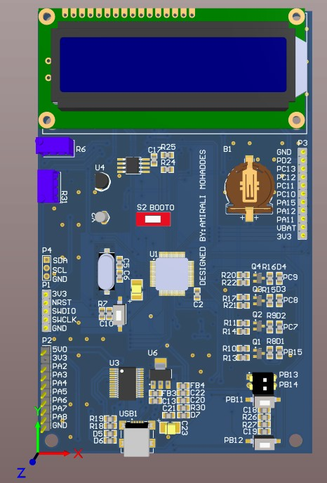

# STM32class_PCB_project
 STM32F103RET6 development board
 
 #### board capabilities:
 
 
 1. ARM Cortex M3 Microcontroller
 
 2. SD Card holder
 
 3. RTC backup battery
 
 4. AT24C512 EEPROM
 
 5. 2X16 Charachter LCD
 
 6. Multi turn potentiometer connected to ADC
 
 7. LM35 temperature sensor connected to ADC
 
 8. USB to Serial (UART) converter using FT232rl IC
 
 9. 4 LEDs
 
 10. 2 push buttons & dip switchs

